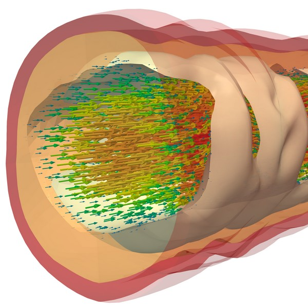

| <a href="https://github.com/FEDDLib/FEDDLib" target="_blank">GitHub Repository</a> | <a href="mailto:feddlib-contact@uni-koeln.de" target="_blank">Contact Email</a> |

The <a href="https://github.com/FEDDLib/FEDDLib" target="_blank">Finite Element and Domain Decomposition Library (FEDDLib)</a> is an open-source, C++-based, object-oriented finite element library that is built on top of <a href="https://trilinos.github.io/" target="_blank">Trilinos</a> and has access to domain decomposition solvers, particularly via <a href="https://cds.uni-koeln.de/en/tools/software/frosch" target="_blank">FROSch</a>, a subpackage of Trilinos. Trilinos is a software project for the solution of complex multiphysics problems in science and engineering. It has a multitude of (mostly) interoperable packages, for example, for parallel linear algebra operations, meshing, and the solution of linear and nonlinear problems. 

FEDDLib has been successfully applied to problems of fluid dynamics, solid mechanics, fluid-structure interaction, and fluid-structure-chemistry interaction; see the references at the bottom.

The FEDDLib code base is developed jointly by the group of <a href="https://numerik.uni-koeln.de/" target="_blank">Prof. Dr. Axel Klawonn</a> (University of Cologne) with <a href="https://numerik.uni-koeln.de/arbeitsgruppe/l-sassmannshausen-m-sc" target="_blank">Lea Saßmannshausen</a>, <a href="https://numerik.uni-koeln.de/arbeitsgruppe/k-ho-m-sc" target="_blank">Kyrill Ho</a>, <a href="https://numerik.uni-koeln.de/arbeitsgruppe/n-kubicki-m-sc" target="_blank">Natalie Kubicki</a>, and <a href="https://numerik.uni-koeln.de/arbeitsgruppe/dr-j-knepper" target="_blank">Dr. Jascha Knepper</a>, by <a href="https://www.tudelft.nl/staff/a.heinlein/" target="_blank">Dr. Alexander Heinlein</a> (TU Delft), and by the group of <a href="https://tu-freiberg.de/fakultaet1/institute/numerische-mathematik-und-optimierung/team" target="_blank">Prof. Dr. Oliver Rheinbach</a> (TU Bergakademie Freiberg).

**References**

- <a href="https://github.com/FEDDLib/FEDDLib" target="_blank">FEDDLib GitHub Repository</a>
- <a href="https://doi.org/10.1002/gamm.202370002" target="_blank">A computational framework for pharmaco-mechanical interactions in arterial walls using parallel monolithic domain decomposition methods (2024)</a>
- <a href="https://doi.org/10.1002/pamm.202200133" target="_blank">First steps towards modeling the interaction of cardiovascular agents and smooth muscle activation in arterial walls (2023)</a>
- <a href="https://doi.org/10.1007/978-3-030-55874-1_52" target="_blank">Fully algebraic two-level overlapping Schwarz preconditioners for elasticity problems (2021)</a>
- <a href="http://nbn-resolving.de/urn:nbn:de:hbz:38-113450" target="_blank">Parallel Overlapping Schwarz Preconditioners for Incompressible Fluid Flow and Fluid-Structure Interaction Problems (2020)</a>: FEDDLib was initially developed in the scope of Christian Hochmuth's dissertation. It has since undergone considerable further development.
- <a href="https://doi.org/10.1002/nme.6258" target="_blank">Reduced dimension GDSW coarse spaces for monolithic Schwarz domain decomposition methods for incompressible fluid flow problems (2020)</a>
- <a href="https://doi.org/10.1137/18M1184047" target="_blank">Monolithic Overlapping Schwarz Domain Decomposition Methods with GDSW Coarse Spaces for Incompressible Fluid Flow Problems (2019)</a>
